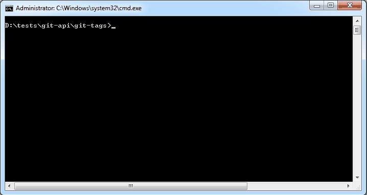

# git-tags
>Create and upload git tags

## Getting Started
This repo will help you to get your existing `git tags`, copy them, rename them and push the new ones back to GitHub.

It can be used for CI/CD systems that uploads version into relevant environment based on the `git tag` name.

## Settings
* change the settings.json `org` to your organisation Git name
* change the settings.json `apps` array to include all relevant apps you want to use
* for each `app`:
  * set display name (`name`)
  * set the repo name (`repo`)
  * set the environments names you want to use(`envs`) 
